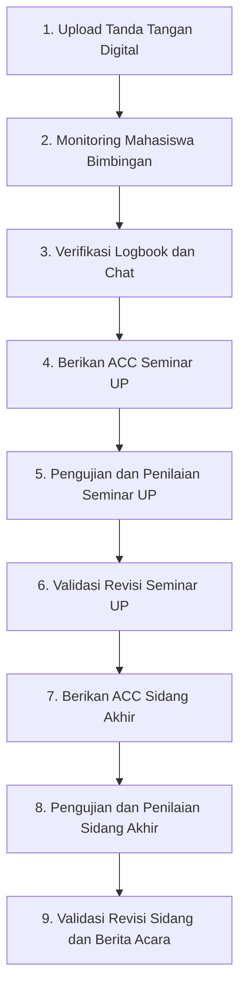

# 👨‍🏫 USER GUIDE: Panduan Lengkap SIBIMA untuk Dosen
**Sistem Informasi Bimbingan Skripsi & Manajemen Akademik (SIBIMA)**
*Fakultas Ilmu Komputer - Universitas Subang*

---

## 📌 Pengantar
Selamat datang di **SIBIMA**! Aplikasi ini dirancang untuk memudahkan **Dosen Pembimbing** dan **Dosen Penguji** dalam memantau progress bimbingan mahasiswa, mengelola logbook, memberikan persetujuan (ACC), melakukan penilaian seminar/sidang, hingga memvalidasi revisi secara digital dan terintegrasi.

---

## 🎭 Peran Dosen di SIBIMA

Dalam sistem SIBIMA, Dosen memiliki 2 fungsi utama:
1. **Dosen Pembimbing (P1 / P2):** Berfokus pada pengarahan materi skripsi, verifikasi logbook, serta pemberian indikator kelayakan (ACC UP dan ACC Sidang).
2. **Dosen Penguji (Penguji UP / Penguji Sidang):** Berfokus pada pengujian mahasiswa saat seminar/sidang, penginputan nilai, penyampaian poin revisi, dan validasi perbaikan naskah final.

---

## 🚀 Alur Kerja Dosen di SIBIMA

> 📍 **Ringkasan Alur Cepat:**  
> **1. Upload TTD Digital** ➔ **2. Monitoring & Validasi Logbook** ➔ **3. Berikan ACC Seminar UP** ➔ **4. Input Nilai & Revisi UP** ➔ **5. Validasi Revisi UP** ➔ **6. Berikan ACC Sidang Akhir** ➔ **7. Input Nilai & Revisi Sidang** ➔ **8. Validasi Revisi & Cetak Berita Acara**

---

## 📖 Step-by-Step Panduan Penggunaan untuk Dosen

### 1️⃣ Persiapan Wajib: Pengaturan Tanda Tangan Digital
Tanda tangan digital sangat penting karena akan otomatis tersemat pada **Lembar Bimbingan**, **Formulir Pendaftaran**, dan **Berita Acara**.
1. Login ke **SIBIMA** menggunakan Akun Dosen.
2. Klik nama/foto profil di sudut kanan atas ➔ pilih **Profil**.
3. Pada bagian **Tanda Tangan Digital**, unggah gambar Tanda Tangan kamu (format PNG/JPG, disarankan tulisan hitam jelas dengan background transparan/putih).
4. Klik **Simpan Tanda Tangan**.

---

### 2️⃣ Tugas Dosen Pembimbing (Monitoring & Bimbingan)

#### A. Melihat Daftar Mahasiswa Bimbingan (Workload)
1. Buka menu **Data Skripsi** di sidebar.
2. Filter status ke **Skripsi Aktif** untuk melihat seluruh mahasiswa bimbingan kamu (baik sebagai Pembimbing 1 maupun Pembimbing 2).
3. Kamu dapat memantau bab/tahap terkini mahasiswa (*Bimbingan UP*, *Lulus UP*, atau *Siap Sidang*).

#### B. Memeriksa & Mengonfirmasi Logbook Bimbingan
1. Klik nama mahasiswa / tombol **Detail** pada tabel skripsi.
2. Gulir ke bawah pada bagian **Riwayat Logbook Bimbingan**.
3. Periksa catatan materi yang diinput oleh mahasiswa.
4. Klik tombol **Setujui / Validasi Logbook** untuk mengonfirmasi bahwa sesi bimbingan tersebut sah.

#### C. Memberikan ACC Seminar UP & ACC Sidang Akhir
1. Buka halaman **Detail Skripsi** mahasiswa yang bersangkutan.
2. Pada bagian atas (Card Status Kelayakan), terdapat 2 tombol sakelar (*Toggle Status*):
   - 🟢 **ACC Seminar UP:** Klik sakelar untuk mengubah status dari *Belum ACC* menjadi *Disetujui UP*. *(Mahasiswa baru bisa mendaftar Seminar UP jika P1 & P2 sudah meng-ACC)*.
   - 🟢 **ACC Sidang Akhir:** Klik sakelar untuk mengubah status dari *Belum ACC* menjadi *Disetujui Sidang*. *(Mahasiswa baru bisa mendaftar Sidang Akhir jika P1 & P2 sudah meng-ACC)*.

#### D. Komunikasi Interaktif via Chat
1. Buka menu **Chat** di sidebar kiri.
2. Pilih nama mahasiswa bimbingan untuk mendiskusikan draft skripsi, revisi bab, atau penjadwalan bimbingan secara *real-time*.

---

### 3️⃣ Tugas Dosen Penguji Seminar UP (Usulan Penelitian)

#### A. Memeriksa Jadwal Seminar UP
1. Buka menu **Penguji Seminar UP** di sidebar.
2. Kamu dapat melihat daftar mahasiswa yang diuji, tanggal/jam seminar, ruangan, serta draft proposal PDF mahasiswa.

#### B. Penginputan Nilai Seminar UP
1. Pada hari H seminar, klik tombol **Input Nilai / Grading** di baris nama mahasiswa.
2. Isi nilai komponen evaluasi (Presentasi, Penguasaan Materi, Metodologi, dan Kualitas Proposal).
3. Sistem akan menghitung akumulasi nilai rata-rata secara otomatis.
4. Klik **Simpan Penilaian**.

#### C. Menginput Catatan Poin Revisi UP
1. Di halaman detail ujian mahasiswa, masuk ke bagian **Catatan Revisi Penguji**.
2. Masukkan poin-poin perbaikan yang wajib dikerjakan oleh mahasiswa (misal: *Perbaiki bab 2 terkait sitasi jurnal*, *Perjelas diagram use case*).
3. Klik **Kirim Catatan Revisi**.

#### D. Validasi & Approval Revisi UP
1. Setelah mahasiswa mengunggah perbaikan, buka kembali menu **Penguji Seminar UP** ➔ pilih mahasiswa.
2. Periksa penjelasan balasan dan file proposal perbaikan dari mahasiswa.
3. Jika perbaikan sudah sesuai, klik **Approve Revisi**. Tanda tangan digital kamu akan otomatis dibubuhkan pada Lembar Pengesahan Revisi mahasiswa.

---

### 4️⃣ Tugas Dosen Penguji Sidang Akhir Skripsi

#### A. Memeriksa Jadwal Sidang Akhir
1. Buka menu **Penguji Sidang Skripsi** di sidebar.
2. Pelajari berkas lengkap naskah skripsi final, artikel jurnal, dan kelengkapan mahasiswa.

#### B. Penginputan Nilai Sidang Akhir
1. Klik tombol **Penilaian Sidang**.
2. Masukkan nilai bobot per kriteria (Sikap/Presentasi, Penguasaan Naskah Skripsi, Tanya Jawab Komprehensif, & Produk/Aplikasi).
3. Klik **Simpan Nilai Akhir**.

#### C. Catatan Revisi & Persetujuan Akhir (Berita Acara)
1. Input poin-poin revisi naskah akhir pada kolom revisi sidang.
2. Setelah mahasiswa mengirimkan perbaikan naskah final, periksa dan klik **Persetujuan Akhir (Approve)** atau gunakan tombol **Direct Approval** jika revisi diselesaikan langsung di tempat.
3. Setelah seluruh penguji meng-ACC revisi:
   - Klik **Export Berita Acara Sidang (PDF)** untuk mengunduh dokumen resmi hasil keputusan sidang yang telah dilengkapi tanda tangan digital seluruh penguji dan QR Code verifikasi.

---

## ❓ FAQ & Tips untuk Dosen

> **Q: Mengapa mahasiswa bimbingan saya tidak bisa mendaftar Seminar UP padahal naskah sudah siap?**  
> *A: Mohon periksa halaman Detail Skripsi mahasiswa tersebut di SIBIMA, lalu pastikan sakelar **ACC Seminar UP** sudah kamu aktifkan (berwarna hijau).*

> **Q: Apakah saya bisa menguji revisi secara langsung tanpa tunggu mahasiswa kirim di sistem?**  
> *A: Ya, tersedia fitur **Approve Direct** pada menu Penguji Sidang jika revisi mahasiswa disetujui langsung saat tatap muka.*

> **Q: Bagaimana jika Tanda Tangan Digital saya belum muncul di Berita Acara PDF?**  
> *A: Pastikan kamu sudah mengunggah file gambar Tanda Tangan Digital di menu **Profil Dosen** sebelum mengklik tombol Approve.*

---
*Terima kasih atas dedikasi Bapak/Ibu Dosen dalam membimbing dan menguji mahasiswa Fakultas Ilmu Komputer Universitas Subang! 🎓*
