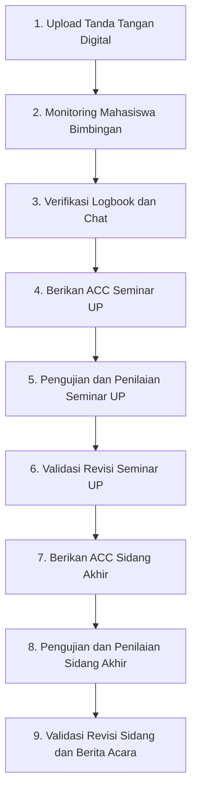

# Panduan Singkat Penggunaan SIBIMA untuk Dosen v1
**Sistem Informasi Bimbingan Mahasiswa (SIBIMA)**
*Fakultas Ilmu Komputer - Universitas Subang*

---

## Pengantar
Selamat datang di **SIBIMA**! Aplikasi ini dirancang untuk memudahkan **Dosen Pembimbing** dan **Dosen Penguji** dalam memantau progress bimbingan mahasiswa, mengelola logbook, memberikan persetujuan (ACC), melakukan penilaian seminar/sidang, hingga memvalidasi revisi secara digital dan terintegrasi.

---

## Peran Dosen di SIBIMA

Dalam sistem SIBIMA, Dosen memiliki 2 fungsi utama:
1. **Dosen Pembimbing (P1 / P2):** Berfokus pada pengarahan materi skripsi, verifikasi logbook, serta pemberian indikator kelayakan (ACC UP dan ACC Sidang).
2. **Dosen Penguji (Penguji UP / Penguji Sidang):** Berfokus pada pengujian mahasiswa saat seminar/sidang, penginputan nilai, penyampaian poin revisi, dan validasi perbaikan naskah final.

---

## Alur Dosen di SIBIMA

> **Ringkasan Alur Cepat:**  
> **1. Upload TTD Digital** ➔ **2. Monitoring & Validasi Logbook** ➔ **3. Berikan ACC Seminar UP** ➔ **4. Input Revisi UP** ➔ **5. Validasi Revisi UP** ➔ **6. Berikan ACC Sidang Akhir** ➔ **7. Input Nilai & Revisi Sidang** ➔ **8. Validasi Revisi & Cetak Berita Acara**

---

## Step-by-Step Panduan Penggunaan untuk Dosen

### 1️⃣ Persiapan Wajib: Pengaturan Tanda Tangan Digital
Tanda tangan digital sangat penting karena akan otomatis tersemat pada **Kartu/Logbook Bimbingan**, dan **Berita Acara**.
1. Login ke **SIBIMA** menggunakan Akun Dosen.
2. Klik nama/foto profil di sudut kanan atas ➔ pilih **Profil**.
3. Pada bagian **Tanda Tangan Digital**, unggah gambar Tanda Tangan (format PNG/JPG, disarankan tulisan hitam jelas dengan background transparan/putih).
4. Klik **Simpan Tanda Tangan**.

---

### 2️⃣ Tugas Dosen Pembimbing (Monitoring & Bimbingan)

#### A. Melihat Daftar Mahasiswa Bimbingan (Workload)
1. Buka menu **Mahasiswa Bimbingan** di sidebar.
2. Filter status ke **Bimbingan Aktif** untuk melihat seluruh mahasiswa bimbingan (baik sebagai Pembimbing 1 maupun Pembimbing 2).
3. Bapak/Ibu dapat memantau bab/tahap terkini mahasiswa (Sudah Seminar/Sidang).

#### B. Membuat Jadwal Bimbingan
1. Klik menu **Jadwal Bimbingan**. Klik tombol **Tambah Jadwal**
2. Pilih Mahasiswa, jika memilih satu mahasiswa maka jadwal hanya dibuat untuk satu mahasiswa saja, jika memilih semua bimbingan mahasiswa maka akan membuat jadwal bimbingan untuk seluruh mahasiswa bimbingan.
3. Atur tanggal, waktU, topik pembahasan dan tipe bimbingan (Online/Offline).
4. Klik tombol **Simpan Jadwal**.

#### C. Memberikan ACC Seminar UP & ACC Sidang Akhir
1. Buka halaman **Jadwal Bimbingan**.
2. Pada bagian atas (Card Status Kelayakan), terdapat 2 tombol sakelar (*Toggle Status*):
   - 🟢 **ACC Seminar UP:** Klik sakelar untuk mengubah status. *(Mahasiswa baru bisa mendaftar Seminar UP jika P1 & P2 sudah meng-ACC)*.
   - 🟢 **ACC Sidang Akhir:** Klik sakelar untuk mengubah status. *(Mahasiswa baru bisa mendaftar Sidang Akhir jika P1 & P2 sudah meng-ACC)*.

#### D. Komunikasi Interaktif via Chat
1. Buka menu **Chat** di sidebar kiri.
2. Pilih nama mahasiswa bimbingan untuk mendiskusikan draft skripsi, revisi bab, atau penjadwalan bimbingan secara *real-time*.

---

### 3️⃣ Tugas Dosen Penguji Seminar UP (Usulan Penelitian) dan Sidang Akhir

#### A. Memeriksa Jadwal Seminar UP / Sidang Akhir
1. Buka menu **Jadwal Seminar / Jadwal Sidang** di sidebar.
2. Bapak/ibu dapat melihat daftar mahasiswa yang diuji, tanggal/jam seminar, ruangan.

#### B. Menginput Catatan Poin Revisi Seminar UP
1. Di menu **Penguji Seminar**, klik tombol **Lihat Revisi** di baris nama mahasiswa.
2. Masukkan poin-poin perbaikan yang wajib dikerjakan oleh mahasiswa (misal: *Perbaiki bab 2 terkait sitasi jurnal*, *Perjelas diagram use case*). jika ada dokumen yang direvisi bisa dilampirkan melalui link Google Drive.
3. Klik **Kirim Catatan Revisi**.
   
#### C. Penginputan Revisi dan Nilai Sidang UP
1. Pada hari H sidang, klik tombol **Input Nilai** di baris nama mahasiswa.
2. Isi nilai komponen evaluasi (Presentasi, Kemampuan Menjelaskan Naskah Skripsi, Penulisan Naskah Skripsi).
3. Sistem akan menghitung akumulasi nilai akhir secara otomatis.
4. Klik **Simpan Penilaian**.

#### D. Validasi & Approval Revisi UP/Sidang
1. Setelah mahasiswa mengunggah perbaikan, buka kembali menu **Penguji Seminar/Sidang** ➔ pilih mahasiswa.
2. Periksa penjelasan balasan dan file proposal perbaikan dari mahasiswa.
3. Jika perbaikan sudah sesuai, klik **Approve Revisi**. 

---

## FAQ & Tips untuk Dosen

> **Q: Mengapa mahasiswa bimbingan saya tidak bisa mendaftar Seminar UP padahal naskah sudah siap?**  
> *A: Mohon periksa halaman Detail Skripsi mahasiswa tersebut di SIBIMA, lalu pastikan sakelar **ACC Seminar UP** sudah kamu aktifkan (berwarna hijau).*

> **Q: Apakah saya bisa menguji revisi secara langsung tanpa tunggu mahasiswa kirim di sistem?**  
> *A: Ya, tersedia fitur **Approve Direct** pada menu Penguji Sidang jika revisi mahasiswa disetujui langsung saat tatap muka.*

> **Q: Bagaimana jika Tanda Tangan Digital saya belum muncul di Berita Acara PDF?**  
> *A: Pastikan kamu sudah mengunggah file gambar Tanda Tangan Digital di menu **Profil Dosen** sebelum mengklik tombol Approve.*

---
*Terima kasih atas dedikasi Bapak/Ibu Dosen dalam membimbing dan menguji mahasiswa Fakultas Ilmu Komputer Universitas Subang! 🎓*
