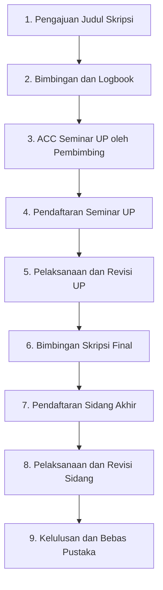

# USER GUIDE: Panduan Lengkap SIBIMA untuk Mahasiswa
**Sistem Informasi Bimbingan Skripsi & Manajemen Akademik (SIBIMA)**
*Fakultas Ilmu Komputer - Universitas Subang*

---

## Pengantar
Selamat datang di **SIBIMA**! Aplikasi ini dirancang untuk mempermudah dan mempercepat seluruh alur penyelesaian Skripsi/Tugas Akhir mahasiswa FASILKOM Universitas Subang, mulai dari pengajuan judul, bimbingan berkala, pendaftaran seminar usulan penelitian (UP), hingga pelaksanaan dan penyelesaian revisi sidang akhir.

---

## Alur Utama Penyelesaian Skripsi di SIBIMA

> **Ringkasan Alur Cepat:**  
> **1. Pengajuan Judul** ➔ **2. Bimbingan & Logbook** ➔ **3. ACC Seminar UP** ➔ **4. Daftar Seminar UP** ➔ **5. Ujian & Revisi UP** ➔ **6. ACC Sidang Akhir** ➔ **7. Daftar Sidang Akhir** ➔ **8. Ujian & Revisi Sidang** ➔ **9. Lulus & Bebas Pustaka**

---

## Step-by-Step Panduan Penggunaan

### 1️⃣ Persiapan Awal & Pengaturan Profil
Sebelum mengajukan judul, pastikan data profil kamu sudah lengkap dan valid.
1. Login ke aplikasi **SIBIMA** menggunakan *NPM* dan *Password* yang telah terdaftar.
2. Klik foto profil / nama kamu di pojok kanan atas, lalu pilih **Profil**.
3. **Upload Tanda Tangan Digital:**
   - Upload file gambar Tanda Tangan Digital (format PNG/JPG tanpa background transparan jika ada).
   - Tanda tangan ini akan otomatis digunakan pada dokumen resmi seperti *Lembar Bimbingan* dan *Formulir Pendaftaran*.
4. Pastikan nomor WhatsApp dan email aktif agar tidak tertinggal notifikasi penting.

---

### 2️⃣ Riset Referensi & Pengajuan Judul Skripsi

#### A. Menggunakan Katalog Pustaka (Referensi Alumni)
1. Buka menu **Katalog Pustaka** di sidebar kiri.
2. Gunakan kolom pencarian untuk melihat judul-judul skripsi alumni FASILKOM berdasarkan kata kunci (misal: *Web, Android, IoT, Machine Learning*) atau filter berdasarkan **Angkatan**.
3. Pelajari topik yang sudah pernah diambil agar judul kamu unik dan tidak duplikat.

#### B. Pengajuan Judul dengan AI Title Checker
1. Buka menu **Skripsi** -> klik tombol **Pengajuan Judul Skripsi**.
2. **Ketikkan Rencana Judul Skripsi:**
   - Saat kamu mengetik judul, **AI Checker** SIBIMA akan secara *real-time* menganalisis tingkat kemiripan judul kamu dengan data Skripsi Aktif maupun Katalog Pustaka Alumni.
   - ⚠️ *Jika muncul peringatan kemiripan tinggi (>50%), modifikasi judul atau objek penelitian kamu agar lebih spesifik dan terhindar dari indikasi plagiarisme.*
3. **Isi Deskripsi / Rencana Ringkasan:** Jelaskan singkat latar belakang dan permasalahan yang akan diteliti.
4. **Pilih Rekomendasi Dosen Pembimbing 1 & 2:** Pilih usulan dosen pembimbing sesuai topik/bidang ilmu yang diteliti.
5. Klik **Kirim Pengajuan**. Status pengajuan kamu akan menjadi `Pending` menunggu persetujuan Kaprodi/Admin.

---

### 3️⃣ Bimbingan & Catatan Logbook Berkala

Setelah judul disetujui oleh Kaprodi dan Dosen Pembimbing ditetapkan (Status: `Aktif`):
1. **Menu Bimbingan Skripsi / Detail Skripsi:**
   - Kamu dapat melihat nama **Dosen Pembimbing 1** dan **Dosen Pembimbing 2**.
   - Terlihat pula *Indikator Status ACC*:
     - 🟡 **ACC Seminar UP:** Belum disetujui / 🟢 Sudah disetujui (P1 & P2).
     - 🟡 **ACC Sidang Akhir:** Belum disetujui / 🟢 Sudah disetujui (P1 & P2).
2. **Mengisi Logbook Bimbingan:**
   - Setiap kali selesai bimbingan (tatap muka maupun *online*), klik **Tambah Log Bimbingan**.
   - Isi tanggal bimbingan, bab/materi yang dibahas, dan catatan masukan dari dosen.
   - Dosen pembimbing akan mengonfirmasi/meng-ACC catatan logbook tersebut.
3. **Fitur Chat Interaktif:**
   - Gunakan menu **Chat** di sidebar untuk berkomunikasi langsung dengan Dosen Pembimbing jika ada pertanyaan seputar draft skripsi.

---

### 4️⃣ Pendaftaran Seminar Usulan Penelitian (UP)

#### A. Syarat Pendaftaran
- Judul Skripsi berstatus **Aktif**.
- Mengantongi **ACC Seminar UP** dari Pembimbing 1 **DAN** Pembimbing 2 pada sistem SIBIMA.

#### B. Langkah Pendaftaran
1. Buka menu **Pendaftaran Seminar UP**.
2. Klik tombol **Daftar Seminar UP**.
3. Upload dokumen persyaratan yang diminta (Draft Proposal PDF, KPRS, Bukti ACC/Logbook, dsb).
4. Klik **Kirim Pendaftaran**.
5. Cek secara berkala status verifikasi berkas oleh Admin/Kaprodi.
6. Setelah diverifikasi, jadwal seminar kamu (Tanggal, Waktu, Ruangan, serta nama **Dosen Penguji 1 & 2**) akan tampil di halaman ini.

---

### 5️⃣ Penyelesaian Revisi Seminar UP

Setelah selesai melaksanakan Seminar UP:
1. Masuk ke menu **Revisi Seminar UP**.
2. Kamu akan melihat daftar poin revisi dan catatan perbaikan yang diinput oleh Dosen Penguji 1 dan Dosen Penguji 2.
3. **Mengirim Tanggapan Revisi:**
   - Klik **Tanggapi / Upload Perbaikan**.
   - Tuliskan penjelasan perbaikan dan unggah file draft proposal yang sudah direvisi.
4. **Validasi Penguji:**
   - Dosen Penguji akan memeriksa perbaikan kamu secara *online*.
   - Jika disetujui, Dosen Penguji akan memberikan **Digital Signature / Approval**.
5. **Cetak Lembar Pengesahan Revisi:**
   - Setelah semua penguji menyetujui, klik tombol **Cetak / Export Lembar Revisi (PDF)** untuk dilampirkan pada berkas fisik kamu.

---

### 6️⃣ Pendaftaran Sidang Akhir Skripsi

#### A. Syarat Pendaftaran
- Telah menyelesaikan dan meluluskan Seminar UP + Revisi UP.
- Mengantongi **ACC Sidang Akhir** dari Pembimbing 1 **DAN** Pembimbing 2 pada sistem SIBIMA.

#### B. Langkah Pendaftaran
1. Buka menu **Pendaftaran Sidang Skripsi**.
2. Klik tombol **Daftar Sidang Akhir**.
3. Upload berkas lengkap (Draft Naskah Skripsi Final, Artikel Jurnal, Transkrip Nilai, Bebas Perpustakaan, dsb).
4. Klik **Kirim Pendaftaran**.
5. Pantau penetapan jadwal Sidang Akhir dan susunan Dosen Penguji Sidang.

---

### 7️⃣ Penyelesaian Revisi Sidang Akhir & Kelulusan

1. Setelah pelaksanaan Sidang Akhir, buka menu **Revisi Sidang Skripsi**.
2. Cek catatan revisi dari Penguji Sidang.
3. Unggah berkas perbaikan akhir naskah skripsi beserta penjelasan poin per poin.
4. Setelah seluruh Dosen Penguji meng-ACC revisi sidang kamu di sistem, status skripsi kamu akan otomatis diperbarui menjadi 🎓 **LULUS / Selesai (Completed)**.
5. Kamu dapat mengunduh **Berita Acara Sidang** dan **Lembar Pengesahan Skripsi Final (PDF)** ber-QR Code resmi dari SIBIMA.

---

## FAQ & Tips untuk Mahasiswa

> **Q: Kenapa judul saya ditolak atau AI Checker menunjukkan angka 80% kemiripan?**  
> *A: Coba periksa kata kunci objek penelitianmu. Tambahkan nama instansi/lokasi atau spesifikasi metode yang unik agar judul lebih berkarakter.*

> **Q: Mengapa saya tidak bisa memencet tombol "Daftar Seminar UP"?**  
> *A: Pastikan Dosen Pembimbing 1 dan Dosen Pembimbing 2 sudah mengklik tombol **ACC UP** di akun mereka masing-masing.*

> **Q: Bagaimana jika dosen pembimbing lupa meng-ACC di sistem?**  
> *A: Kamu bisa mengingatkan dosen secara sopan melalui fitur **Chat SIBIMA** atau saat jadwal bimbingan berlangsung.*

---
*Semoga sukses dan lancar dalam penyelesaian Skripsi di Fakultas Ilmu Komputer Universitas Subang! 🚀*
